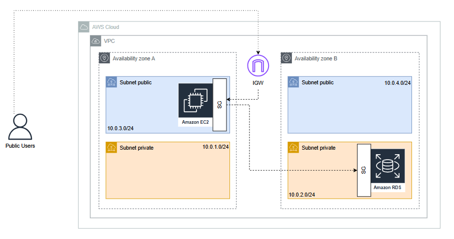

# 🚀 ToggleMaster - Phase 1: Monolith MVP

Bem-vindo à primeira fase do **Tech Challenge** do curso de DevOps (PosTech FIAP)! Este projeto consiste na construção de uma plataforma de _Feature Flag as a Service_ chamada **ToggleMaster**, focando inicialmente na implantação de um MVP monolítico na AWS.

## 🏗️ Arquitetura Cloud (AWS)

A infraestrutura foi desenhada seguindo as melhores práticas de isolamento de rede e segurança, garantindo que componentes críticos não fiquem expostos desnecessariamente.

  

### Detalhes da Infraestrutura:

- **VPC**: Estruturada com sub-redes públicas e privadas em múltiplas zonas de disponibilidade (AZs).
- **Amazon EC2**: Instância localizada na sub-rede pública para hospedar a API (Flask/Gunicorn).
- **Amazon RDS (PostgreSQL)**: Banco de dados gerenciado, isolado na sub-rede privada.
- **Segurança**:
  - **SG EC2**: Permite tráfego na porta `5000` (App) e `22` (SSH restrito).
  - **SG RDS**: Permite tráfego na porta `5432` **apenas** originado pelo Security Group da EC2.

---

## 🛠️ Análise dos 12-Factor App

Abaixo, a análise técnica da aplicação frente à metodologia dos 12 fatores, identificando o que já é atendido e os pontos de evolução para uma produção robusta.

### I. Base de Código (Codebase)

**Status: ✅ Atende**
R: Atende pois atualmente temos uma base única de código para o projeto inteiro.

### II. Dependências

**Status: ✅ Atende**
R: Atende pelo `requirements.txt`, como as versões estão “fixadas" (ex: `Flask==2.2.2` em vez de apenas `Flask`), garantindo que um deploy daqui a seis meses não quebre por causa de uma atualização de biblioteca.

### III. Configurações

**Status: ✅ Atende**
R: A aplicação utiliza `os.getenv` para ler credenciais de banco de dados. Isso é perfeito, pois permite que o mesmo código rode localmente (Docker) e na AWS (RDS) apenas mudando as variáveis de ambiente, sem "hardcoded secrets", podendo ser melhorada ainda mais também usando as env do SSM da AWS.

### IV. Serviços de Apoio

**Status: ✅ Atende**
R: O banco de dados PostgreSQL é tratado como um recurso anexado. A aplicação se conecta via URL/Hostname, o que facilita a troca do container local pelo endpoint do RDS sem alterar a lógica do app que também ao usar o SSM, podemos reforçar o desacoplamento. O "recurso anexado" (RDS) tem suas credenciais gerenciadas por um "serviço de apoio" de segurança (SSM), facilitando, por exemplo, a rotação de senhas sem precisar mexer no deploy da aplicação.

### V. Construa, lance, execute

**Status: ❌ Ajuste**
R: No desafio, o deploy na EC2 é manual. Em uma produção robusta, essas fases deviam ser separadas por uma ferramenta de CI/CD como por exemplo um GIT ACTIONS, onde o artefato gerado no build é imutável e apenas recebe as configurações na fase de release.

### VI. Processos

**Status: ✅ Atende**
R: A aplicação atende plenamente a este fator, operando de forma que não há persistência de dados em disco local ou armazenamento de sessões em memória do servidor. Todo o estado da aplicação reside no Amazon RDS. Como melhoria futura, essa arquitetura facilita a implementação de um Auto Scaling Group, permitindo que instâncias sejam criadas ou destruídas dinamicamente para atender à demanda sem impactar a integridade dos dados ou a experiência do usuário.

### VII. Vínculo de porta

**Status: ✅ Atende**
R: Atende plenamente. A aplicação é autônoma e exporta o serviço HTTP vinculando-se diretamente à porta 5000 através do Gunicorn. Isso elimina a dependência de servidores web externos injetados no sistema operacional. Como por exemplo um Express ou Fastify do node js em uma aplicação js também atenderia a este requisito.

### VIII. Concorrência

**Status: ✅ Atende**
R: A aplicação utiliza o modelo de processos através do Gunicorn, permitindo a execução de múltiplos workers independentes. Isso possibilita que a aplicação escale horizontalmente e aproveite ao máximo os recursos computacionais da instância EC2, tratando cada requisição como um processo isolado e descartável.

### IX. Descartabilidade

**Status: ⚠️ Parcial**
R: Atende parcialmente. A inicialização é ágil e validada via script de entrypoint. Como melhoria, deve-se implementar o graceful shutdown para que o processo encerre conexões ativas com o RDS e finalize requisições pendentes antes de desligar totalmente, garantindo a integridade dos dados e da experiência do usuário.

### X. Dev/prod semelhantes

**Status: ⚠️ Parcial**
R: Posso dizer que atende parcialmente pois local por exemplo a versão do postgresql é 13 já no rds está a 17. Porem se fosse um arquitetura de container onde eu subisse a imagem para minha EC2 conseguira manter essa integridade totalmente igual desdás configurações do SO até as configurações utilizadas. Exemplo a imagem python:3.9-slim roda em um debian:buster-20210208-slim e em prod estamos em uma amazon Linux 2023. e também não utilizamos nenhum pipeline ainda para fazer a redução da diferença entre 1 ou mais ambientes.

### XI. Logs

**Status: ⚠️ Parcial**
R: A aplicação já emite logs via saída padrão (stdout), delegando a captura ao ambiente. No entanto, ainda carece de centralização e persistência externa. Poderia melhorar implementando um modelo de Log Streaming, onde os eventos são despachados para um Message Broker (ex: RabbitMQ). A partir daí, consumers especializados realizam a persistência e análise em ferramentas como CloudWatch ou Grafana Loki, garantindo a observabilidade independente do ciclo de vida da instância.

### XII. Processos de Admin

**Status: ✅ Atende**
R: Atende plenamente. Tarefas de gerenciamento, como a inicialização do esquema do banco de dados, são executadas como processos independentes que utilizam a mesma base de código e configurações de ambiente da aplicação principal. Isso evita divergências entre scripts de manutenção e o código em execução, garantindo consistência administrativa em todos os níveis do deploy.

---

**Participante:** Bruno Santos  
**Curso:** PosTech FIAP - DevOps & Cloud Architecture
